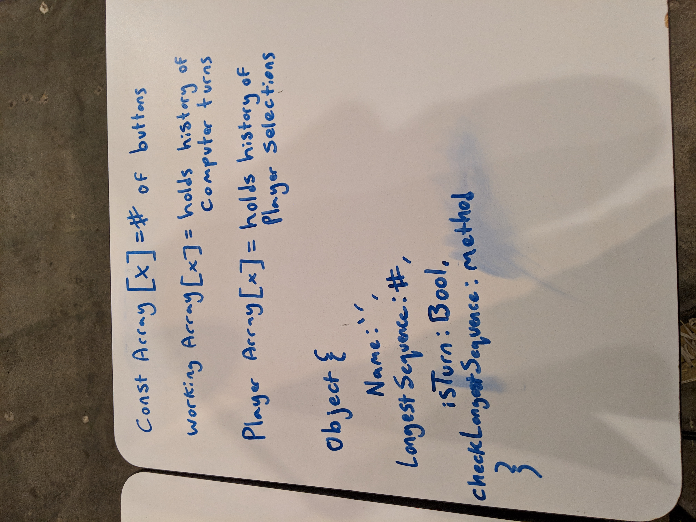
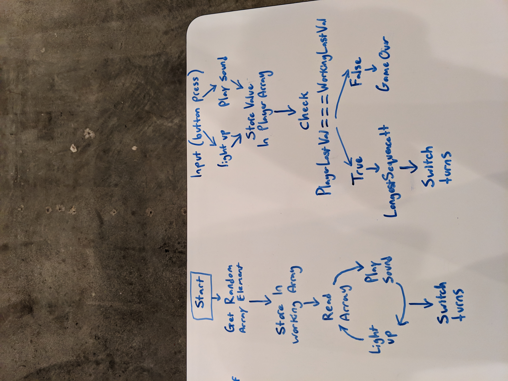
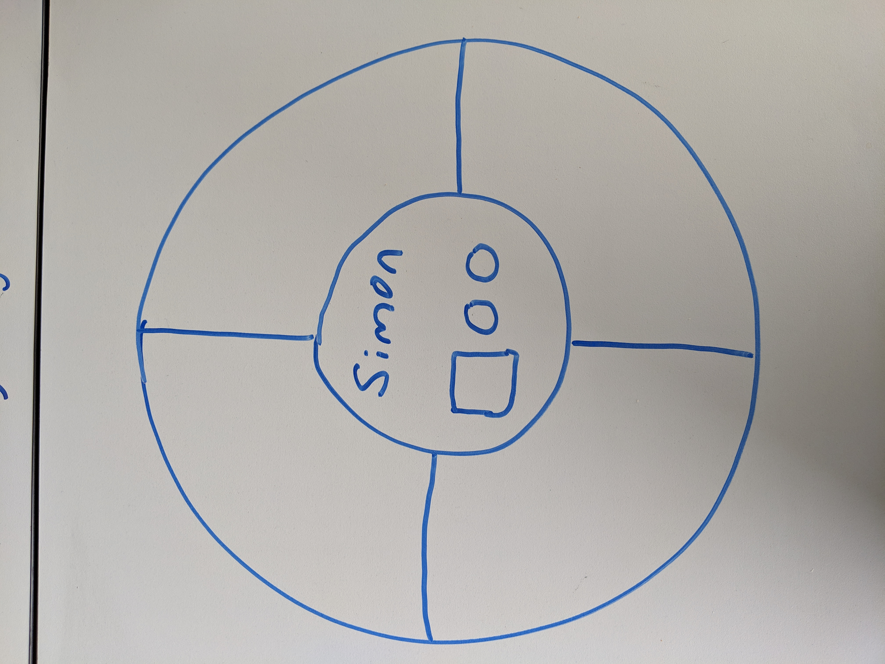

# simon_says
A simon says game that allows one player to compete with the computer in a memory based pattern game

## Whiteboarding

##Wireframe

##Trello Board
<https://trello.com/b/blN9LcMV/simonsays>

##Game Link
<https://sambarksdale.github.io/simon_says/>